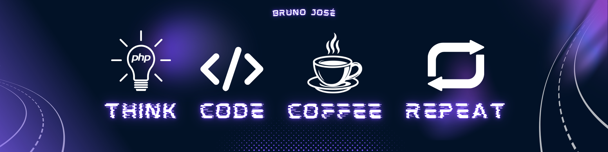
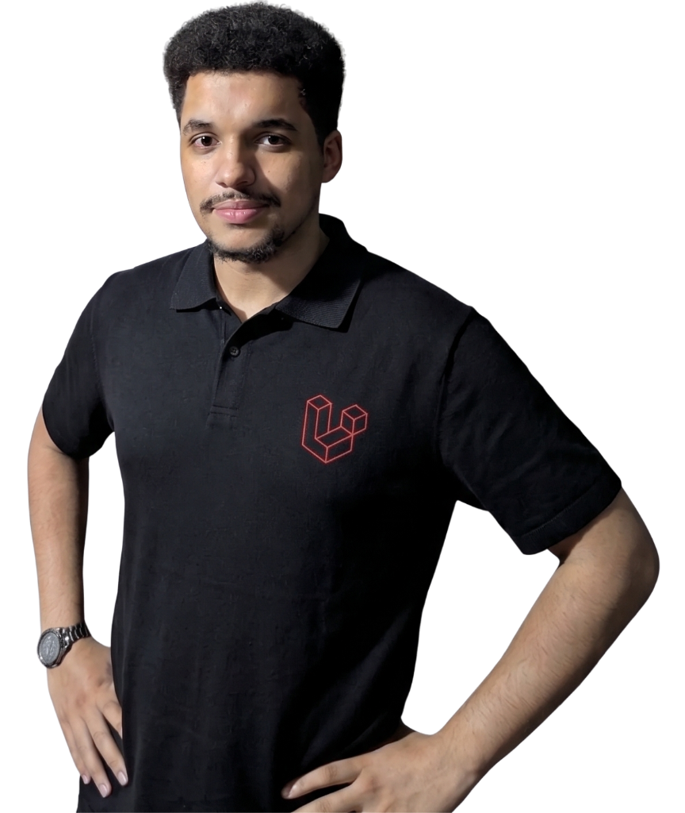

  

<h1 align="center">Olá, me chamo <b>Bruno</b>! 👋🤝</h1>
 

  
  <code><b>Transformar ideias em resultados práticos e ajudar pessoas:</b> esse é o meu verdadeiro motor.</code>
   
   
  Sou <b>desenvolvedor backend</b> formado em Ciência da Computação com uma <u>forte veia empreendedora</u>. Para mim, a tecnologia vai muito além do código: ela é o motor que mudou a minha vida e a base dos negócios que quero construir. Gosto de trabalhar a mente pensando em <u>soluções que gerem impacto real</u>. Não escrevo código apenas pela tecnologia em si; <u>eu construo sistemas para resolver problemas e fazer projetos vencerem</u>.
   
   
  No aspecto técnico, tenho experiência corporativa construindo APIs escaláveis com <b>PHP</b> e <b>Laravel</b>, desenhando arquiteturas robustas baseadas em Hexagonal/Clean Architecture, DDD, TDD e SOLID. No aspecto humano, <b>valorizo a comunicação assertiva, a análise de problemáticas e o pensamento estratégico</b>, garantindo que o código sempre trabalhe a favor do negócio e das pessoas.

## 💻 Linguagens & Tecnologias

